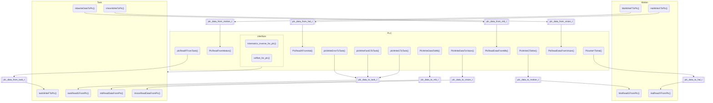

```mermaid
flowchart TB
M("MotWriteFToPlc()") --> D[["plc_data_from_motion_t"]]
D --> P("PlcReadFromMotion()")
P1("PlcWriteGToMot()") --> D1[["plc_data_to_motion_t"]]
D1 --> M1("MotReadGFromPlc()")
M2("HalWriteXToPlc()") --> D2[["plc_data_from_hal_t"]] 
D2 --> P2("PlcReadXFromHal()")
P3("PlcwriteYToHal()") --> D3[["plc_data_to_hal_t"]] 
D3 --> M3("HalReadYFromPlc()")
P4("plcReadFFromTask()") --> D4[["plc_data_from_task_t"]]
D4 --> T1("taskWriteFToPlc()")
P5("plcWriteErrorToTask()") --> D5[["plc_data_to_task_t"]]
P6("plcWriteFastGToTask()") --> D5
P7("plcWriteGToTask()") --> D5
D5 --> T2("taskReadGFromPlc()")
T3("mbwriteDataToPlc()") --> D6[["plc_data_from_mb_t"]]
D6 --> P8("PlcReadDataFromMb()")
P9("PlcWriteDataToMb()") --> D7[["plc_data_to_mb_t"]]
D7 --> T4("mbReadDataFromPlc()")
T5("VisionWriteToPlc()") --> D8[["plc_data_from_vision_t"]]
D8 --> P10("PlcReadDataFromVision()")
P11("PlcWriteDataToVision()") --> D9[["plc_data_to_vision_t"]]
D9 --> T6("VisionReadDataFromPlc()")
subgraph Motion
	M
	M1
	M2
	M3
end
subgraph Task
	T1
	T2
	T3
	T4
	T5
	T6
end
subgraph PLC
	subgraph interface
		P12("kinematics_inverse_for_plc()")
		P13("voffset_for_plc()")
	end
	P
	P1
	P2
	P3
	P4
	P5
	P6
	P7
	P8
	P9
	P10
	P11
end
interface --> Task

```

